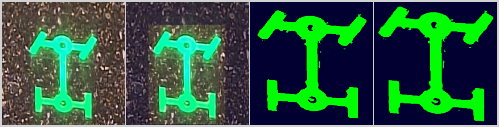

# telltale-preprocess
A lightweight, frontend only, non-AI preprocessing pipeline for detecting, cropping and enhancing dashboard icons from images using JavaScript and the Canvas API.  

This documentation showcases a frontend image preprocessing pipeline I built during my tenure as a GAT as JCB.  

---

## Objectives

- Design a *lightweight, frontend-only, non-AI image preprocessing pipeline* for Red, Green, Blue and Orange/Amber color icons using JavaScript and Canvas API
- Detect and crop relevant regions of dashboard icons from raw images
- Remove background noise to generate cleaner input for prediction systems
- Improve the performance and accuracy of downstream AI or rule-based models
- Avoid dependency on AI models during the preprocessing phase

---

## Key Features & Advantages

### 🔹 Lightweight Pipeline
Designed without any AI or external libraries, this image preprocessing pipeline runs entirely in the browser using only JavaScript and the Canvas API. It’s fast, memory-efficient, and easy to integrate.

### 🔹 Frontend-Only Implementation
Built purely in the frontend environment using HTML5 Canvas and JavaScript, making it deployable on any web-based system without requiring backend dependencies.

### 🔹 Non-AI Logic
Uses traditional image processing techniques like dominant color detection and pixel-based filtering instead of deep learning, reducing complexity and increasing reliability.

### 🔹 High Accuracy on Clear Images
Achieves *100% detection accuracy* on clean, high-resolution dashboard images. Logic performance gracefully degrades with image quality but remains effective in most practical scenarios.

### 🔹 Significant Boost in Model Accuracy
When integrated into the pipeline of an AI prediction system, the preprocessing increased the model's accuracy from *~40% to 70–80%*, showcasing the impact of clean input preparation.

### 🔹 Real-Time Performance
Capable of processing images in real time within the browser, with minimal latency — ideal for embedded dashboards or client-side applications.

### 🔹 Modular Logic
Each step — color detection, cropping, background cleanup — is logically separated and can be improved or replaced independently, supporting scalability and testing.

### 🔹 Adaptable Design
Though tailored for dashboard telltale icons, the pipeline can be adapted for similar structured image preprocessing tasks in other domains (e.g., automotive, UI analysis).

---

## Pipeline Steps (Overview)

1. *Input ImageData Extraction*  
   The pipeline begins by receiving an `ImageData` object extracted from a canvas element.

2. *Dominant Color Detection*  
   Identify the dominant color by pixel count and the intensity.

3. *Region Cropping*  
   Dynamically crop out the region of interest (ROI) that has the dominant color.

4. *Noise Removal*  
   Clean the cropped region to isolate the icon and reduce background artifacts (other that the dominant color). Again crop the image to get exact icon.

5. *Clean Image Output*  
   Forward the processed icon to the prediction system for better results.

---

## Sample Results  
Input image | Cropping | Enhancement | Final output  

1. Red icons:  
     
   

2. Green icons:
     
   

3. Orange icons:
     
     
     
   *Note:* **Enhancement** is not applied to orange icons due to their multiple shades.

4. Blue icons:  
     
   *Note:* complete result is not available to show.

---

## Main Process:  
   

